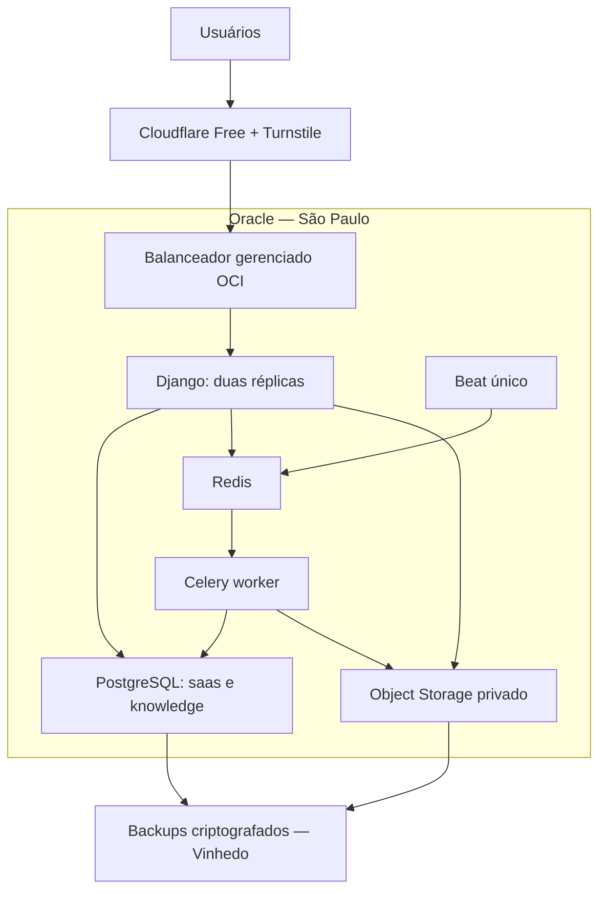

# CICA: Oracle Cloud no Brasil, com expansão preparada desde o início

## 1. Escolha após a comparação

**Minha recomendação é Oracle Cloud Infrastructure (OCI), em conta paga, com aplicação em São Paulo e backups em Vinhedo.** Para as prioridades definidas — até R$ 300 inicialmente, centralização, dados no Brasil e crescimento automatizável — ela oferece a combinação mais interessante que consegui verificar.

Isso substitui a proposta anterior de Locaweb + Magalu.

| Opção avaliada | Conclusão para a CICA |
|---|---|
| **Oracle Cloud** | Melhor combinação encontrada de memória, custo, balanceador e duas regiões brasileiras. Exige validar ARM e administrar o PostgreSQL inicialmente. |
| **AWS** | Melhor alternativa. Lightsail começa acessível, mas a passagem para ECS/RDS exige migração planejada. Máquina de 8 GB custa US$ 44 antes dos demais recursos. |
| **Fly.io** | Boa experiência de deploy; banco gerenciado começa em US$ 38 sozinho, pressionando o orçamento. |
| **Google Cloud e Azure** | Alternativas capazes; não obtive uma composição completa com vantagem de custo comprovada sobre a configuração OCI abaixo. |
| **Vultr** | Candidata viável para máquinas; não confirmei toda a composição de storage e backup brasileiros necessária para recomendá-la como solução centralizada. |
| **Locaweb e ServerSP** | Podem reduzir a conta da VPS, mas exigem montar mais da operação e da expansão por conta própria. |
| **Render, Railway e DigitalOcean** | As listas atuais de regiões não atendem à exigência de hospedagem brasileira. |
| **Magalu** | Excluída por sua preferência. |

Fontes: [AWS](https://docs.aws.amazon.com/lightsail/latest/userguide/amazon-lightsail-bundles.html), [Fly](https://fly.io/pricing/), [Render](https://render.com/docs/regions), [Railway](https://docs.railway.com/deployments/regions), [DigitalOcean](https://docs.digitalocean.com/platform/regional-availability/).

**A escolha não depende de “servidor grátis”.** A Oracle documenta restrições de capacidade e recolhimento de instâncias gratuitas ociosas; essas condições não serão a base da operação comercial. [Regras oficiais](https://docs.oracle.com/en-us/iaas/Content/FreeTier/freetier_topic-Always_Free_Resources.htm)

## 2. Arquitetura e orçamento inicial

Concentrar o tráfego operacional em **São Paulo**, usando rede privada entre componentes. Manter somente a recuperação em outra região brasileira. A Oracle possui regiões em São Paulo e Vinhedo. [Regiões oficiais](https://docs.oracle.com/en-us/iaas/Content/General/Concepts/regions.htm)

Inicialmente, Django, PostgreSQL, Redis e Celery compartilham **uma VM de 2 OCPUs ARM e 12 GB de RAM**, em containers separados. O balanceador e o armazenamento são serviços externos à VM.

| Item | Estimativa mensal |
|---|---:|
| VM: 2 OCPUs e 12 GB RAM | R$ 145,24 |
| 80 GB de disco, desempenho Balanced | R$ 17,80 |
| Balanceador: cálculo conservador até 20 Mbps | R$ 50,83 |
| 100 GB totais entre documentos, versões e backups | R$ 13,35 |
| **Subtotal técnico** | **R$ 227,22** |
| Margem até o teto | **R$ 72,78** |

Cálculo com 730 horas e tarifas públicas em BRL consultadas em 18/09/2026, **sem descontar franquias gratuitas**. Tributos, requisições, logs e transferências devem entrar na cotação final; a margem não garante cobertura de consumo ilimitado. [Catálogo oficial de preços](https://apexapps.oracle.com/pls/apex/cetools/api/v1/products/)

Manter IA, Serpro, domínio e eventual plano pago do Brevo separados desse orçamento.

**Limite inicial:** continua existindo uma única VM. O balanceador já fica pronto para receber mais servidores, mas não elimina sozinho a indisponibilidade do banco ou dessa máquina.

## 3. Automação e crescimento

**Automatizar desde a primeira implantação:**

- Infraestrutura declarada em Terraform e configuração do servidor com Ansible.
- Build de imagens versionadas, testes, publicação, health checks e retorno à imagem anterior quando o schema permitir.
- Reinício de serviços, backups, verificação de integridade, alertas e limpeza de artefatos conforme retenção.
- Deploy alternando as réplicas Django, com drenagem de conexões.
- Monitoramento central de disponibilidade, memória, CPU, latência, conexões ao banco e idade das filas.
- Imagens preparadas para ARM e x86, evitando dependência permanente de uma arquitetura.

**Preparar a aplicação para ganhar servidores:**

- Sessões compartilhadas; nenhum documento persistente dentro do container.
- Tarefas idempotentes, com recuperação pelo estado persistido no banco.
- Workers separados da aplicação web; apenas um agendador ativo.
- Migrações compatíveis com a versão anterior e executadas uma vez por publicação.
- Credenciais, endereços e limites configuráveis, sem mudanças de URLs públicas ao expandir.

**Evolução definida:**

| Fase | Mudança |
|---|---|
| Piloto | Uma VM, balanceador gerenciado, storage e recuperação externos à VM. |
| Crescimento | Separar banco/Redis da aplicação e adicionar servidores web ao balanceador. |
| Escala automática | Usar grupos de instâncias para aplicação; escalar workers conforme atraso e volume das filas. |
| Maior disponibilidade | Introduzir redundância de banco, failover testado e capacidade para sobreviver à perda de um servidor. |

A OCI possui autoscaling de grupos de máquinas por métricas e horários. [Documentação](https://docs.oracle.com/en-us/iaas/Content/Compute/Tasks/autoscalinginstancepools.htm)

**Expansão sem interrupção passa a ser viável quando houver redundância.** Aumentar recursos da VM única ou migrar o banco inicialmente pode exigir uma janela. Não prometer expansão “perfeita” antes de testar essas transições.

Automação dentro da capacidade contratada fica habilitada. Criação de máquinas e aumentos cobrados permanecem bloqueados até aprovação específica, conforme sua regra de custos; um alerta de orçamento não impede sozinho uma fatura maior.

## 4. Segurança e recuperação

- Cloudflare Free com HTTPS estrito, regras gratuitas de WAF e proteção DDoS; limites adicionais no proxy e Django.
- Origem web restrita à Cloudflare; VM aceita tráfego da aplicação somente pelo balanceador. Banco e Redis sem portas públicas.
- Administração por acesso restrito, chave e MFA; permissões mínimas no provedor.
- Turnstile no cadastro e recuperação de senha, e após falhas repetidas de login. Validação obrigatória no servidor, incluindo expiração, uso único, hostname e ação. [Contrato oficial](https://developers.cloudflare.com/turnstile/get-started/server-side-validation/)
- Webhooks e agentes usam autenticação própria, sem CAPTCHA. Preservar mTLS nos endpoints que exigirem essa autenticação.
- Buckets privados, downloads temporários autorizados e nenhum cache de documentos ou páginas autenticadas na Cloudflare.
- Manter criptografia de campos, TLS, isolamento por escritório e chaves de recuperação guardadas separadamente.
- Antimalware com atualização de assinaturas e quarentena; arquivos não liberados enquanto a verificação estiver indisponível.

**Recuperação:** preservar RPO de 15 minutos e RTO de 4 horas. PostgreSQL com pgBackRest e WAL contínuo; cópia incremental dos documentos para Vinhedo, monitorando atraso. Retenção operacional inicial de 30 dias, sem substituir a política de retenção documental dos clientes.

A aplicação não poderá apagar os backups. Usar credenciais separadas e proteção de retenção homologada. Logs e backups permanecem no Brasil; as exceções de processamento por Cloudflare, Claude e Brevo seguem a política de dados já discutida.

## 5. Execução, testes e condições de implantação

1. Registrar a substituição do plano na memória canônica e atualizar Q-35 e a etapa 12, preservando os demais trabalhos.
2. **Validar ARM antes de contratar:** construir as imagens da aplicação, PostgreSQL, Redis e antimalware; testar dependências de PDF, criptografia e processamento documental. Emulação local não comprova desempenho.
3. Preparar infraestrutura, pipeline, políticas de acesso, backups e procedimentos de recuperação.
4. Apresentar a cotação da conta real: região, disponibilidade de A1, tributos, limites e custo temporário dos ensaios. Não contratar se ultrapassar R$ 300 sem nova decisão.
5. Implantar piloto isolado e medir 10 usuários simultâneos com tarefas reais representativas, sem chamadas externas cobradas por inferência.
6. Testar perda de container, worker, Redis e VM; restaurar banco, arquivos e chaves em ambiente separado e comprovar RPO/RTO.
7. Ensaiar inclusão e retirada de um servidor no balanceador, preservação de sessões e ausência de duplicação de tarefas.
8. Validar CAPTCHA e telas alteradas com o fluxo obrigatório de UI/UX, Web Interface Guidelines e Playwright, encerrando as sessões.
9. Registrar resultados e limitações antes da liberação. Falta de capacidade ARM, incompatibilidade ou reprovação nos testes bloqueia a implantação; não provoca troca silenciosa de provedor ou aumento de gasto.

**Resultado pretendido:** começar com custo controlado e mais memória, manter a infraestrutura concentrada no Brasil e deixar o crescimento reproduzível, sem precisar redesenhar a aplicação a cada expansão.
